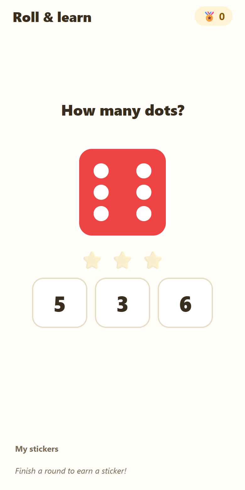

# Roll & Learn

A counting game for young children on Android (built for a 5-year-old): roll a die, count the dots, pick the number word, name the color. Expo + React Native + TypeScript.

[](https://github.com/Jsingh-26/roll-and-learn/actions/workflows/ci.yml)



<sub>Screenshot from an Expo web export of the same code; the app itself targets Android.</sub>

## How it works

- Each round the child rolls, then answers three questions about the die: **how many dots** (tap the number), **which word** (`one`, `two`, `three`, …), and **what color** (the answers show the color's name as a word to read, not a swatch to match).
- Two modes: **🎲 Count** (one die) and **➕ Add two** (two dice; the answer is the sum, 2–12, with nearby wrong answers).
- Each question shows the right answer and two random wrong ones, shuffled.
- Correct taps earn stars; a finished round earns a collectible sticker, saved on the device with AsyncStorage.
- Right answers get a sound and a haptic tap; a finished round gets confetti. Wrong taps get a soft "try again", never a harsh buzzer.
- The whole game lives in `src/GameScreen.tsx`; the die, confetti, sounds and the color and word tables are small separate files.

## Decisions

- **Sounds are generated, not downloaded.** `scripts/gen-sounds.js` writes every effect as a WAV from code, so there are no third-party audio files and no licenses to track.
- **The die is drawn from plain Views, not images.** A bold face color, a thick white border and pip colors picked for contrast (dark dots on yellow) keep it readable on any background. This replaced an earlier version where the die clashed with the background.
- **The test build is an APK, not an app bundle.** The `preview` profile in [`eas.json`](./eas.json) outputs an `.apk` so it installs straight onto a phone; `production` keeps the Play Store app bundle.

## Tests and running locally

There are no automated tests yet. CI runs `npm ci` and a TypeScript check (`npx tsc --noEmit`) on every push to `main` and every pull request.

```bash
npm install
npx tsc --noEmit    # same check as CI
npx expo start --dev-client --tunnel   # needs the dev-client APK (below); store Expo Go can't open SDK 56
npm run android     # or run on an Android emulator
```

### One-time: the development build

The app targets Expo SDK 56, which the store version of Expo Go doesn't run. Build a small dev client once, install it on the phone, then scan the QR from it:

```bash
npm install -g eas-cli && eas login
eas build -p android --profile development   # prints a link to the .apk
```

The repo also opens ready-to-run in GitHub Codespaces (`.devcontainer/`).

### Build an installable APK

Uses [EAS Build](https://docs.expo.dev/build/introduction/) (cloud) and a free [Expo account](https://expo.dev).

```bash
npm install -g eas-cli
eas login
eas build -p android --profile preview
```

### Regenerate the sounds

```bash
node scripts/gen-sounds.js   # rewrites assets/sounds/*.wav
```

## Project layout

| Path | What it is |
|------|------------|
| `App.tsx` | App entry: sets up audio, renders the game |
| `src/GameScreen.tsx` | Round flow, scoring, stickers, animations |
| `src/Dice.tsx` | Die face drawn from plain Views |
| `src/Confetti.tsx` | Confetti celebration |
| `src/sounds.ts` | Loads and plays the sound effects |
| `src/colors.ts` | Die colors, number words, pip layouts, stickers |
| `scripts/gen-sounds.js` | Generates the WAV sound effects |

## License

MIT
